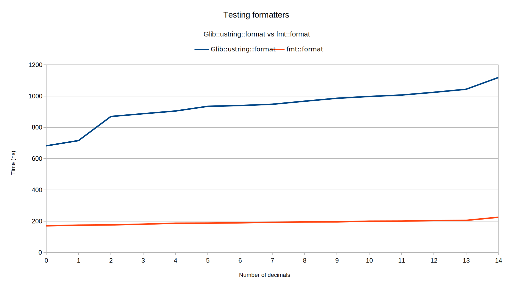
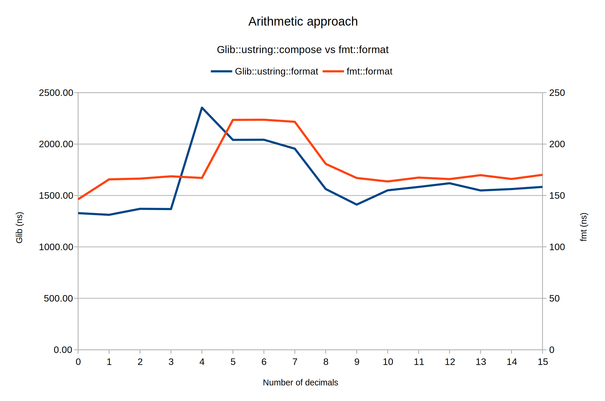

# vs `Glib::ustring`

To conclude, {fmt} is fast!

<details>
<summary>Benchmark result</summary>

```
Randomness seeded to: 2851490110

~~~~~~~~~~~~~~~~~~~~~~~~~~~~~~~~~~~~~~~~~~~~~~~~~~~~~~~~~~~~~~~~~~~~~~~~~~~~~~~
scratch_pad_test is a Catch2 v3.0.1 at devel commit: 3a18a688a07e3f7217d7a1b0ae45a324edfdef52 host application.
Run with -? for options

-------------------------------------------------------------------------------
Simple format
-------------------------------------------------------------------------------
/home/nandanv/code/C++/scratch_pad/src/vs_glib_ustring.cpp:15
...............................................................................

benchmark name                       samples       iterations    estimated
                                     mean          low mean      high mean
                                     std dev       low std dev   high std dev
-------------------------------------------------------------------------------
{fmt}                                          100          1260       4.41 ms 
                                        34.3702 ns     34.207 ns     34.626 ns 
                                        1.02637 ns   0.743215 ns    1.36252 ns 
                                                                               
{fmt} to Glib::ustring                         100           480      4.416 ms 
                                        90.7163 ns    90.4946 ns    91.3477 ns 
                                        1.74672 ns    0.59582 ns    3.71523 ns 
                                                                               
Glib::ustring::format                          100           108     4.4388 ms 
                                        398.697 ns    397.382 ns    401.208 ns 
                                        8.86411 ns    4.84562 ns    13.5393 ns 
                                                                               
Glib::ustring::compose                         100            65     4.4655 ms 
                                        637.088 ns     630.33 ns    651.782 ns 
                                        48.1325 ns    27.7148 ns    88.6021 ns 
                                                                               

-------------------------------------------------------------------------------
Float format
-------------------------------------------------------------------------------
/home/nandanv/code/C++/scratch_pad/src/vs_glib_ustring.cpp:42
...............................................................................

benchmark name                       samples       iterations    estimated
                                     mean          low mean      high mean
                                     std dev       low std dev   high std dev
-------------------------------------------------------------------------------
{fmt}                                          100           457     4.4329 ms 
                                        92.8359 ns    92.3064 ns    93.5906 ns 
                                        3.18763 ns     2.4274 ns    3.95575 ns 
                                                                               
{fmt} to Glib::ustring                         100           282     4.4274 ms 
                                         151.58 ns    150.278 ns    153.198 ns 
                                        7.38239 ns    6.14967 ns    8.49176 ns 
                                                                               
Glib::ustring::format                          100            53     4.4732 ms 
                                        804.482 ns    794.823 ns    814.962 ns 
                                        51.6408 ns    46.4237 ns    60.2149 ns 
                                                                               
Glib::ustring::compose                         100            41      4.469 ms 
                                        997.596 ns    987.292 ns    1.01223 us 
                                        61.7331 ns    47.8604 ns    86.6906 ns 
                                                                               

===============================================================================
All tests passed (1 assertion in 3 test cases)

```

</details>

# Custom `double` formatter with variable decimals



<details>
<summary>Benchmark result</summary>

```
Randomness seeded to: 3166038873

~~~~~~~~~~~~~~~~~~~~~~~~~~~~~~~~~~~~~~~~~~~~~~~~~~~~~~~~~~~~~~~~~~~~~~~~~~~~~~~
scratch_pad_test is a Catch2 v3.0.1 at devel commit: 3a18a688a07e3f7217d7a1b0ae45a324edfdef52 host application.
Run with -? for options

-------------------------------------------------------------------------------
Custom decimals
  Decimals: 0
-------------------------------------------------------------------------------
/home/nandanv/code/C++/scratch_pad/src/vs_glib_ustring.cpp:85
...............................................................................

benchmark name                       samples       iterations    estimated
                                     mean          low mean      high mean
                                     std dev       low std dev   high std dev
-------------------------------------------------------------------------------
{fmt} to Glib::ustring                         100           267     4.6992 ms 
                                        160.436 ns    159.961 ns     160.97 ns 
                                        2.55535 ns    2.23234 ns    3.38473 ns 
                                                                               
Glib::ustring::format                          100            60      4.728 ms 
                                        721.144 ns     715.02 ns    740.929 ns 
                                        50.3211 ns    18.7495 ns    111.462 ns 
                                                                               

-------------------------------------------------------------------------------
Custom decimals
  Decimals: 1
-------------------------------------------------------------------------------
/home/nandanv/code/C++/scratch_pad/src/vs_glib_ustring.cpp:85
...............................................................................

benchmark name                       samples       iterations    estimated
                                     mean          low mean      high mean
                                     std dev       low std dev   high std dev
-------------------------------------------------------------------------------
{fmt} to Glib::ustring                         100           226     4.6782 ms 
                                        188.081 ns    187.474 ns    189.228 ns 
                                        4.10007 ns    2.42304 ns    6.21416 ns 
                                                                               
Glib::ustring::format                          100            58     4.7328 ms 
                                        761.761 ns    755.236 ns    782.977 ns 
                                        54.4486 ns    19.5432 ns    122.018 ns 
                                                                               

-------------------------------------------------------------------------------
Custom decimals
  Decimals: 2
-------------------------------------------------------------------------------
/home/nandanv/code/C++/scratch_pad/src/vs_glib_ustring.cpp:85
...............................................................................

benchmark name                       samples       iterations    estimated
                                     mean          low mean      high mean
                                     std dev       low std dev   high std dev
-------------------------------------------------------------------------------
{fmt} to Glib::ustring                         100           221     4.6852 ms 
                                        217.658 ns    207.064 ns     231.98 ns 
                                        62.4155 ns    49.4902 ns    74.6244 ns 
                                                                               
Glib::ustring::format                          100            49     4.7334 ms 
                                         892.36 ns    886.816 ns    907.175 ns 
                                        42.8126 ns    16.4697 ns    88.0432 ns 
                                                                               

-------------------------------------------------------------------------------
Custom decimals
  Decimals: 3
-------------------------------------------------------------------------------
/home/nandanv/code/C++/scratch_pad/src/vs_glib_ustring.cpp:85
...............................................................................

benchmark name                       samples       iterations    estimated
                                     mean          low mean      high mean
                                     std dev       low std dev   high std dev
-------------------------------------------------------------------------------
{fmt} to Glib::ustring                         100           216     4.6872 ms 
                                        196.177 ns    195.598 ns    197.008 ns 
                                        3.51938 ns    2.75664 ns    5.56855 ns 
                                                                               
Glib::ustring::format                          100            48     4.7376 ms 
                                        910.143 ns      905.1 ns    921.239 ns 
                                        36.2636 ns    20.2978 ns    71.8885 ns 
                                                                               

-------------------------------------------------------------------------------
Custom decimals
  Decimals: 4
-------------------------------------------------------------------------------
/home/nandanv/code/C++/scratch_pad/src/vs_glib_ustring.cpp:85
...............................................................................

benchmark name                       samples       iterations    estimated
                                     mean          low mean      high mean
                                     std dev       low std dev   high std dev
-------------------------------------------------------------------------------
{fmt} to Glib::ustring                         100           183     4.7031 ms 
                                        243.837 ns    243.301 ns    246.025 ns 
                                        4.73358 ns   0.843196 ns    10.9908 ns 
                                                                               
Glib::ustring::format                          100            41     4.6904 ms 
                                        1.16952 us    1.16687 us    1.17604 us 
                                        19.9771 ns    10.0717 ns     41.345 ns 
                                                                               

-------------------------------------------------------------------------------
Custom decimals
  Decimals: 5
-------------------------------------------------------------------------------
/home/nandanv/code/C++/scratch_pad/src/vs_glib_ustring.cpp:85
...............................................................................

benchmark name                       samples       iterations    estimated
                                     mean          low mean      high mean
                                     std dev       low std dev   high std dev
-------------------------------------------------------------------------------
{fmt} to Glib::ustring                         100           184      4.692 ms 
                                        253.154 ns     252.02 ns    256.032 ns 
                                         8.1334 ns    1.08144 ns    14.9239 ns 
                                                                               
Glib::ustring::format                          100            38     4.7234 ms 
                                         1.2964 us    1.28084 us    1.35436 us 
                                        134.446 ns    25.9436 ns    308.062 ns 
                                                                               

-------------------------------------------------------------------------------
Custom decimals
  Decimals: 6
-------------------------------------------------------------------------------
/home/nandanv/code/C++/scratch_pad/src/vs_glib_ustring.cpp:85
...............................................................................

benchmark name                       samples       iterations    estimated
                                     mean          low mean      high mean
                                     std dev       low std dev   high std dev
-------------------------------------------------------------------------------
{fmt} to Glib::ustring                         100           181      4.706 ms 
                                        247.541 ns    247.384 ns    247.895 ns 
                                        1.14289 ns   0.500534 ns    2.17291 ns 
                                                                               
Glib::ustring::format                          100            41     4.7273 ms 
                                        1.11373 us    1.10986 us    1.12732 us 
                                        32.9249 ns    10.3615 ns    74.8728 ns 
                                                                               

-------------------------------------------------------------------------------
Custom decimals
  Decimals: 7
-------------------------------------------------------------------------------
/home/nandanv/code/C++/scratch_pad/src/vs_glib_ustring.cpp:85
...............................................................................

benchmark name                       samples       iterations    estimated
                                     mean          low mean      high mean
                                     std dev       low std dev   high std dev
-------------------------------------------------------------------------------
{fmt} to Glib::ustring                         100           154      4.697 ms 
                                        302.376 ns    301.623 ns    304.946 ns 
                                        6.08793 ns   0.590855 ns    13.6948 ns 
                                                                               
Glib::ustring::format                          100            40      4.708 ms 
                                        1.16786 us     1.1644 us    1.17919 us 
                                         28.778 ns    10.1282 ns    64.3731 ns 
                                                                               

-------------------------------------------------------------------------------
Custom decimals
  Decimals: 8
-------------------------------------------------------------------------------
/home/nandanv/code/C++/scratch_pad/src/vs_glib_ustring.cpp:85
...............................................................................

benchmark name                       samples       iterations    estimated
                                     mean          low mean      high mean
                                     std dev       low std dev   high std dev
-------------------------------------------------------------------------------
{fmt} to Glib::ustring                         100           187      4.675 ms 
                                        245.389 ns    245.093 ns    246.181 ns 
                                        2.27405 ns   0.691029 ns    4.57514 ns 
                                                                               
Glib::ustring::format                          100            39     4.6878 ms 
                                        1.11239 us     1.1009 us    1.15917 us 
                                        107.624 ns    11.4879 ns    255.521 ns 
                                                                               

-------------------------------------------------------------------------------
Custom decimals
  Decimals: 9
-------------------------------------------------------------------------------
/home/nandanv/code/C++/scratch_pad/src/vs_glib_ustring.cpp:85
...............................................................................

benchmark name                       samples       iterations    estimated
                                     mean          low mean      high mean
                                     std dev       low std dev   high std dev
-------------------------------------------------------------------------------
{fmt} to Glib::ustring                         100           190      4.693 ms 
                                        237.288 ns     237.11 ns    237.651 ns 
                                        1.23717 ns    0.70775 ns    2.01073 ns 
                                                                               
Glib::ustring::format                          100            39     4.7229 ms 
                                        1.15924 us    1.15649 us    1.16389 us 
                                        17.8764 ns      11.31 ns    27.8077 ns 
                                                                               

-------------------------------------------------------------------------------
Custom decimals
  Decimals: 10
-------------------------------------------------------------------------------
/home/nandanv/code/C++/scratch_pad/src/vs_glib_ustring.cpp:85
...............................................................................

benchmark name                       samples       iterations    estimated
                                     mean          low mean      high mean
                                     std dev       low std dev   high std dev
-------------------------------------------------------------------------------
{fmt} to Glib::ustring                         100           190      4.674 ms 
                                        245.028 ns    244.698 ns    246.198 ns 
                                        2.74505 ns   0.452152 ns    6.11857 ns 
                                                                               
Glib::ustring::format                          100            39     4.7619 ms 
                                        1.16765 us    1.16407 us    1.18105 us 
                                        31.4007 ns     7.6961 ns    72.7698 ns 
                                                                               

-------------------------------------------------------------------------------
Custom decimals
  Decimals: 11
-------------------------------------------------------------------------------
/home/nandanv/code/C++/scratch_pad/src/vs_glib_ustring.cpp:85
...............................................................................

benchmark name                       samples       iterations    estimated
                                     mean          low mean      high mean
                                     std dev       low std dev   high std dev
-------------------------------------------------------------------------------
{fmt} to Glib::ustring                         100           189     4.7061 ms 
                                        239.136 ns    238.605 ns    241.178 ns 
                                        4.61397 ns    1.06357 ns    10.6271 ns 
                                                                               
Glib::ustring::format                          100            40      4.764 ms 
                                        1.18733 us    1.18121 us    1.21125 us 
                                        55.4638 ns    9.92593 ns    130.395 ns 
                                                                               

-------------------------------------------------------------------------------
Custom decimals
  Decimals: 12
-------------------------------------------------------------------------------
/home/nandanv/code/C++/scratch_pad/src/vs_glib_ustring.cpp:85
...............................................................................

benchmark name                       samples       iterations    estimated
                                     mean          low mean      high mean
                                     std dev       low std dev   high std dev
-------------------------------------------------------------------------------
{fmt} to Glib::ustring                         100           184      4.692 ms 
                                        240.973 ns    240.838 ns    241.273 ns 
                                         0.9742 ns   0.395332 ns    1.68287 ns 
                                                                               
Glib::ustring::format                          100            39     4.7151 ms 
                                        1.25658 us    1.24424 us    1.28807 us 
                                        94.0393 ns    46.0754 ns    199.215 ns 
                                                                               

-------------------------------------------------------------------------------
Custom decimals
  Decimals: 13
-------------------------------------------------------------------------------
/home/nandanv/code/C++/scratch_pad/src/vs_glib_ustring.cpp:85
...............................................................................

benchmark name                       samples       iterations    estimated
                                     mean          low mean      high mean
                                     std dev       low std dev   high std dev
-------------------------------------------------------------------------------
{fmt} to Glib::ustring                         100           177     4.7082 ms 
                                        249.592 ns     249.34 ns    250.138 ns 
                                        1.80861 ns    1.00952 ns    2.94284 ns 
                                                                               
Glib::ustring::format                          100            39     4.7112 ms 
                                        1.21539 us    1.20604 us    1.25739 us 
                                        86.4142 ns    10.1955 ns    204.424 ns 
                                                                               

-------------------------------------------------------------------------------
Custom decimals
  Decimals: 14
-------------------------------------------------------------------------------
/home/nandanv/code/C++/scratch_pad/src/vs_glib_ustring.cpp:85
...............................................................................

benchmark name                       samples       iterations    estimated
                                     mean          low mean      high mean
                                     std dev       low std dev   high std dev
-------------------------------------------------------------------------------
{fmt} to Glib::ustring                         100           162     4.6818 ms 
                                        290.847 ns    285.663 ns    301.634 ns 
                                        36.4047 ns    20.6214 ns    60.8661 ns 
                                                                               
Glib::ustring::format                          100            37     4.7656 ms 
                                        1.28352 us    1.27545 us    1.31469 us 
                                        73.7173 ns     11.856 ns     173.58 ns 
                                                                               

===============================================================================
All tests passed (1 assertion in 2 test cases)
```


</details>

# Custom arithmetic formatter with variable decimals



<details>
<summary>Benchmark result</summary>

```
Randomness seeded to: 1914990661

~~~~~~~~~~~~~~~~~~~~~~~~~~~~~~~~~~~~~~~~~~~~~~~~~~~~~~~~~~~~~~~~~~~~~~~~~~~~~~~
scratch_pad_test is a Catch2 v3.0.1 at devel commit: 3a18a688a07e3f7217d7a1b0ae45a324edfdef52 host application.
Run with -? for options

-------------------------------------------------------------------------------
Custom decimals
  Using formatters
  Decimals: 0
-------------------------------------------------------------------------------
/home/nandanv/code/C++/scratch_pad/src/vs_glib_ustring.cpp:131
...............................................................................

benchmark name                       samples       iterations    estimated
                                     mean          low mean      high mean
                                     std dev       low std dev   high std dev
-------------------------------------------------------------------------------
{fmt} to Glib::ustring                         100           253      4.554 ms 
                                        166.299 ns    165.217 ns    167.742 ns 
                                        6.34594 ns    5.24485 ns    8.97909 ns 
                                                                               
Glib::ustring::format                          100            61     4.6055 ms 
                                        667.319 ns    663.407 ns    681.986 ns 
                                         34.982 ns    7.05993 ns    81.9556 ns 
                                                                               

-------------------------------------------------------------------------------
Custom decimals
  Using formatters
  Decimals: 1
-------------------------------------------------------------------------------
/home/nandanv/code/C++/scratch_pad/src/vs_glib_ustring.cpp:131
...............................................................................

benchmark name                       samples       iterations    estimated
                                     mean          low mean      high mean
                                     std dev       low std dev   high std dev
-------------------------------------------------------------------------------
{fmt} to Glib::ustring                         100           231     4.5507 ms 
                                        180.308 ns    179.341 ns    181.694 ns 
                                        5.81469 ns    4.30364 ns    9.48224 ns 
                                                                               
Glib::ustring::format                          100            60      4.614 ms 
                                        723.359 ns    717.841 ns    747.574 ns 
                                         50.319 ns    6.83659 ns    118.485 ns 
                                                                               

-------------------------------------------------------------------------------
Custom decimals
  Using formatters
  Decimals: 2
-------------------------------------------------------------------------------
/home/nandanv/code/C++/scratch_pad/src/vs_glib_ustring.cpp:131
...............................................................................

benchmark name                       samples       iterations    estimated
                                     mean          low mean      high mean
                                     std dev       low std dev   high std dev
-------------------------------------------------------------------------------
{fmt} to Glib::ustring                         100           226     4.5426 ms 
                                        183.405 ns    183.098 ns    184.248 ns 
                                        2.37829 ns   0.954523 ns    4.90567 ns 
                                                                               
Glib::ustring::format                          100            51     4.5645 ms 
                                        857.052 ns    848.831 ns    888.648 ns 
                                        75.3843 ns     11.226 ns    178.083 ns 
                                                                               

-------------------------------------------------------------------------------
Custom decimals
  Using formatters
  Decimals: 3
-------------------------------------------------------------------------------
/home/nandanv/code/C++/scratch_pad/src/vs_glib_ustring.cpp:131
...............................................................................

benchmark name                       samples       iterations    estimated
                                     mean          low mean      high mean
                                     std dev       low std dev   high std dev
-------------------------------------------------------------------------------
{fmt} to Glib::ustring                         100           218     4.5562 ms 
                                        195.177 ns     194.52 ns    197.553 ns 
                                        5.58269 ns    1.08815 ns    12.6254 ns 
                                                                               
Glib::ustring::format                          100            50      4.605 ms 
                                        863.443 ns    855.928 ns    893.351 ns 
                                        65.4014 ns    8.26637 ns    151.024 ns 
                                                                               

-------------------------------------------------------------------------------
Custom decimals
  Using formatters
  Decimals: 4
-------------------------------------------------------------------------------
/home/nandanv/code/C++/scratch_pad/src/vs_glib_ustring.cpp:131
...............................................................................

benchmark name                       samples       iterations    estimated
                                     mean          low mean      high mean
                                     std dev       low std dev   high std dev
-------------------------------------------------------------------------------
{fmt} to Glib::ustring                         100           217      4.557 ms 
                                         200.52 ns    198.972 ns     203.23 ns 
                                        10.1952 ns    6.36557 ns    16.0529 ns 
                                                                               
Glib::ustring::format                          100            49     4.6256 ms 
                                        887.017 ns    882.542 ns    899.668 ns 
                                        35.2925 ns    14.9918 ns    75.3291 ns 
                                                                               

-------------------------------------------------------------------------------
Custom decimals
  Using formatters
  Decimals: 5
-------------------------------------------------------------------------------
/home/nandanv/code/C++/scratch_pad/src/vs_glib_ustring.cpp:131
...............................................................................

benchmark name                       samples       iterations    estimated
                                     mean          low mean      high mean
                                     std dev       low std dev   high std dev
-------------------------------------------------------------------------------
{fmt} to Glib::ustring                         100           216     4.5576 ms 
                                        191.184 ns    191.062 ns    191.467 ns 
                                       0.883626 ns   0.309597 ns    1.57388 ns 
                                                                               
Glib::ustring::format                          100            49     4.6109 ms 
                                        884.302 ns    877.055 ns    912.757 ns 
                                        64.8356 ns    12.9947 ns    151.537 ns 
                                                                               

-------------------------------------------------------------------------------
Custom decimals
  Using formatters
  Decimals: 6
-------------------------------------------------------------------------------
/home/nandanv/code/C++/scratch_pad/src/vs_glib_ustring.cpp:131
...............................................................................

benchmark name                       samples       iterations    estimated
                                     mean          low mean      high mean
                                     std dev       low std dev   high std dev
-------------------------------------------------------------------------------
{fmt} to Glib::ustring                         100           213     4.5582 ms 
                                        202.169 ns    201.363 ns    203.454 ns 
                                        5.07848 ns    3.49399 ns     8.1384 ns 
                                                                               
Glib::ustring::format                          100            47     4.5966 ms 
                                        900.608 ns    891.036 ns    937.421 ns 
                                        84.2186 ns    18.6816 ns    195.589 ns 
                                                                               

-------------------------------------------------------------------------------
Custom decimals
  Using formatters
  Decimals: 7
-------------------------------------------------------------------------------
/home/nandanv/code/C++/scratch_pad/src/vs_glib_ustring.cpp:131
...............................................................................

benchmark name                       samples       iterations    estimated
                                     mean          low mean      high mean
                                     std dev       low std dev   high std dev
-------------------------------------------------------------------------------
{fmt} to Glib::ustring                         100           212      4.558 ms 
                                        198.472 ns    198.092 ns    199.096 ns 
                                        2.43194 ns    1.49318 ns    4.49418 ns 
                                                                               
Glib::ustring::format                          100            47      4.606 ms 
                                        889.234 ns    885.877 ns    895.152 ns 
                                         22.123 ns    13.9727 ns    35.0671 ns 
                                                                               

-------------------------------------------------------------------------------
Custom decimals
  Using formatters
  Decimals: 8
-------------------------------------------------------------------------------
/home/nandanv/code/C++/scratch_pad/src/vs_glib_ustring.cpp:131
...............................................................................

benchmark name                       samples       iterations    estimated
                                     mean          low mean      high mean
                                     std dev       low std dev   high std dev
-------------------------------------------------------------------------------
{fmt} to Glib::ustring                         100           211     4.5576 ms 
                                        240.328 ns    240.043 ns     241.06 ns 
                                        2.06911 ns   0.270143 ns    3.85939 ns 
                                                                               
Glib::ustring::format                          100            37     4.6583 ms 
                                        1.21802 us    1.21125 us    1.23549 us 
                                        49.5445 ns    7.05869 ns    95.0684 ns 
                                                                               

-------------------------------------------------------------------------------
Custom decimals
  Using formatters
  Decimals: 9
-------------------------------------------------------------------------------
/home/nandanv/code/C++/scratch_pad/src/vs_glib_ustring.cpp:131
...............................................................................

benchmark name                       samples       iterations    estimated
                                     mean          low mean      high mean
                                     std dev       low std dev   high std dev
-------------------------------------------------------------------------------
{fmt} to Glib::ustring                         100           165      4.554 ms 
                                        295.623 ns    281.383 ns    316.521 ns 
                                        86.8983 ns    64.1516 ns    110.164 ns 
                                                                               
Glib::ustring::format                          100            36     4.6512 ms 
                                        1.27205 us    1.25658 us    1.30955 us 
                                        114.817 ns    61.1183 ns    233.635 ns 
                                                                               

-------------------------------------------------------------------------------
Custom decimals
  Using formatters
  Decimals: 10
-------------------------------------------------------------------------------
/home/nandanv/code/C++/scratch_pad/src/vs_glib_ustring.cpp:131
...............................................................................

benchmark name                       samples       iterations    estimated
                                     mean          low mean      high mean
                                     std dev       low std dev   high std dev
-------------------------------------------------------------------------------
{fmt} to Glib::ustring                         100           159     4.5474 ms 
                                        249.354 ns    248.869 ns    251.341 ns 
                                        4.28159 ns   0.554334 ns    9.94168 ns 
                                                                               
Glib::ustring::format                          100            38     4.6284 ms 
                                        1.17985 us     1.1713 us    1.19895 us 
                                        61.3841 ns    28.2188 ns    103.797 ns 
                                                                               

-------------------------------------------------------------------------------
Custom decimals
  Using formatters
  Decimals: 11
-------------------------------------------------------------------------------
/home/nandanv/code/C++/scratch_pad/src/vs_glib_ustring.cpp:131
...............................................................................

benchmark name                       samples       iterations    estimated
                                     mean          low mean      high mean
                                     std dev       low std dev   high std dev
-------------------------------------------------------------------------------
{fmt} to Glib::ustring                         100           168     4.5528 ms 
                                        254.924 ns    254.052 ns     256.33 ns 
                                        5.55822 ns    3.89951 ns      8.936 ns 
                                                                               
Glib::ustring::format                          100            38      4.617 ms 
                                        1.19149 us    1.17733 us    1.23109 us 
                                        110.135 ns    47.1709 ns    232.943 ns 
                                                                               

-------------------------------------------------------------------------------
Custom decimals
  Using formatters
  Decimals: 12
-------------------------------------------------------------------------------
/home/nandanv/code/C++/scratch_pad/src/vs_glib_ustring.cpp:131
...............................................................................

benchmark name                       samples       iterations    estimated
                                     mean          low mean      high mean
                                     std dev       low std dev   high std dev
-------------------------------------------------------------------------------
{fmt} to Glib::ustring                         100           152       4.56 ms 
                                        273.359 ns    272.367 ns    275.836 ns 
                                        7.07967 ns   0.451239 ns    13.4293 ns 
                                                                               
Glib::ustring::format                          100            38     4.6664 ms 
                                        1.19681 us    1.19299 us    1.20528 us 
                                        27.6259 ns    15.7182 ns    55.5781 ns 
                                                                               

-------------------------------------------------------------------------------
Custom decimals
  Using formatters
  Decimals: 13
-------------------------------------------------------------------------------
/home/nandanv/code/C++/scratch_pad/src/vs_glib_ustring.cpp:131
...............................................................................

benchmark name                       samples       iterations    estimated
                                     mean          low mean      high mean
                                     std dev       low std dev   high std dev
-------------------------------------------------------------------------------
{fmt} to Glib::ustring                         100           172      4.558 ms 
                                        256.252 ns    255.789 ns    257.999 ns 
                                        3.91072 ns   0.393046 ns    8.93655 ns 
                                                                               
Glib::ustring::format                          100            36     4.6476 ms 
                                        1.22472 us    1.21926 us    1.23442 us 
                                        36.1664 ns    24.1284 ns    64.9474 ns 
                                                                               

-------------------------------------------------------------------------------
Custom decimals
  Using formatters
  Decimals: 14
-------------------------------------------------------------------------------
/home/nandanv/code/C++/scratch_pad/src/vs_glib_ustring.cpp:131
...............................................................................

benchmark name                       samples       iterations    estimated
                                     mean          low mean      high mean
                                     std dev       low std dev   high std dev
-------------------------------------------------------------------------------
{fmt} to Glib::ustring                         100           152     4.5752 ms 
                                        301.914 ns    301.263 ns    304.685 ns 
                                        5.84357 ns    0.63155 ns    13.6732 ns 
                                                                               
Glib::ustring::format                          100            36     4.5828 ms 
                                        1.29153 us    1.28166 us    1.32583 us 
                                         83.749 ns    25.4675 ns     189.86 ns 
                                                                               

-------------------------------------------------------------------------------
Custom decimals
  Using formatters
  Decimals: 15
-------------------------------------------------------------------------------
/home/nandanv/code/C++/scratch_pad/src/vs_glib_ustring.cpp:131
...............................................................................

benchmark name                       samples       iterations    estimated
                                     mean          low mean      high mean
                                     std dev       low std dev   high std dev
-------------------------------------------------------------------------------
{fmt} to Glib::ustring                         100           156     4.5708 ms 
                                        290.939 ns    286.827 ns    300.132 ns 
                                        29.6792 ns    12.3307 ns    51.0619 ns 
                                                                               
Glib::ustring::format                          100            36     4.6404 ms 
                                        1.25902 us    1.25349 us    1.27815 us 
                                        46.6878 ns    12.2971 ns    105.423 ns 
                                                                               

-------------------------------------------------------------------------------
Custom decimals
  Using a arithmetic approach
  Decimals: 0
-------------------------------------------------------------------------------
/home/nandanv/code/C++/scratch_pad/src/vs_glib_ustring.cpp:150
...............................................................................

benchmark name                       samples       iterations    estimated
                                     mean          low mean      high mean
                                     std dev       low std dev   high std dev
-------------------------------------------------------------------------------
{fmt} to Glib::ustring                         100           256     4.5568 ms 
                                        161.364 ns    160.437 ns     163.57 ns 
                                        6.83277 ns     2.8656 ns    12.7202 ns 
                                                                               
Glib::ustring::format                          100            34     4.6852 ms 
                                         1.3073 us    1.29716 us    1.31984 us 
                                        57.2019 ns    47.9857 ns     69.489 ns 
                                                                               

-------------------------------------------------------------------------------
Custom decimals
  Using a arithmetic approach
  Decimals: 1
-------------------------------------------------------------------------------
/home/nandanv/code/C++/scratch_pad/src/vs_glib_ustring.cpp:150
...............................................................................

benchmark name                       samples       iterations    estimated
                                     mean          low mean      high mean
                                     std dev       low std dev   high std dev
-------------------------------------------------------------------------------
{fmt} to Glib::ustring                         100           266     4.5486 ms 
                                        160.361 ns    159.689 ns    161.493 ns 
                                        4.37921 ns    2.86941 ns    6.75145 ns 
                                                                               
Glib::ustring::format                          100            32      4.688 ms 
                                        1.27573 us    1.26658 us    1.31719 us 
                                        84.8564 ns    10.7402 ns    201.037 ns 
                                                                               

-------------------------------------------------------------------------------
Custom decimals
  Using a arithmetic approach
  Decimals: 2
-------------------------------------------------------------------------------
/home/nandanv/code/C++/scratch_pad/src/vs_glib_ustring.cpp:150
...............................................................................

benchmark name                       samples       iterations    estimated
                                     mean          low mean      high mean
                                     std dev       low std dev   high std dev
-------------------------------------------------------------------------------
{fmt} to Glib::ustring                         100           244     4.5628 ms 
                                        154.575 ns    154.039 ns     155.41 ns 
                                        3.35544 ns    2.40435 ns    4.73842 ns 
                                                                               
Glib::ustring::format                          100            32     4.5824 ms 
                                        1.37227 us    1.36165 us    1.41435 us 
                                        93.2187 ns    21.0254 ns    215.293 ns 
                                                                               

-------------------------------------------------------------------------------
Custom decimals
  Using a arithmetic approach
  Decimals: 3
-------------------------------------------------------------------------------
/home/nandanv/code/C++/scratch_pad/src/vs_glib_ustring.cpp:150
...............................................................................

benchmark name                       samples       iterations    estimated
                                     mean          low mean      high mean
                                     std dev       low std dev   high std dev
-------------------------------------------------------------------------------
{fmt} to Glib::ustring                         100           245     4.5325 ms 
                                        169.211 ns    168.644 ns    170.243 ns 
                                        3.79992 ns    2.41585 ns    6.03983 ns 
                                                                               
Glib::ustring::format                          100            30      4.647 ms 
                                        1.43558 us    1.42006 us     1.4891 us 
                                        131.011 ns    40.0015 ns    295.825 ns 
                                                                               

-------------------------------------------------------------------------------
Custom decimals
  Using a arithmetic approach
  Decimals: 4
-------------------------------------------------------------------------------
/home/nandanv/code/C++/scratch_pad/src/vs_glib_ustring.cpp:150
...............................................................................

benchmark name                       samples       iterations    estimated
                                     mean          low mean      high mean
                                     std dev       low std dev   high std dev
-------------------------------------------------------------------------------
{fmt} to Glib::ustring                         100           257     4.5489 ms 
                                        165.932 ns    164.971 ns    167.097 ns 
                                        5.37725 ns    4.52554 ns    6.77291 ns 
                                                                               
Glib::ustring::format                          100            28     4.6816 ms 
                                        1.51244 us    1.49579 us     1.5569 us 
                                        127.539 ns    53.2954 ns    262.559 ns 
                                                                               

-------------------------------------------------------------------------------
Custom decimals
  Using a arithmetic approach
  Decimals: 5
-------------------------------------------------------------------------------
/home/nandanv/code/C++/scratch_pad/src/vs_glib_ustring.cpp:150
...............................................................................

benchmark name                       samples       iterations    estimated
                                     mean          low mean      high mean
                                     std dev       low std dev   high std dev
-------------------------------------------------------------------------------
{fmt} to Glib::ustring                         100           249     4.5318 ms 
                                         168.65 ns    168.276 ns    169.737 ns 
                                        2.97163 ns   0.845659 ns    6.37301 ns 
                                                                               
Glib::ustring::format                          100            28     4.5724 ms 
                                        1.51172 us    1.50125 us    1.54257 us 
                                        84.2968 ns    35.7339 ns    185.212 ns 
                                                                               

-------------------------------------------------------------------------------
Custom decimals
  Using a arithmetic approach
  Decimals: 6
-------------------------------------------------------------------------------
/home/nandanv/code/C++/scratch_pad/src/vs_glib_ustring.cpp:150
...............................................................................

benchmark name                       samples       iterations    estimated
                                     mean          low mean      high mean
                                     std dev       low std dev   high std dev
-------------------------------------------------------------------------------
{fmt} to Glib::ustring                         100           252     4.5612 ms 
                                        185.941 ns    178.512 ns    196.626 ns 
                                        45.1549 ns    34.6911 ns    55.0324 ns 
                                                                               
Glib::ustring::format                          100            28     4.6172 ms 
                                        1.57803 us     1.5666 us    1.62461 us 
                                        101.903 ns    16.3127 ns    237.815 ns 
                                                                               

-------------------------------------------------------------------------------
Custom decimals
  Using a arithmetic approach
  Decimals: 7
-------------------------------------------------------------------------------
/home/nandanv/code/C++/scratch_pad/src/vs_glib_ustring.cpp:150
...............................................................................

benchmark name                       samples       iterations    estimated
                                     mean          low mean      high mean
                                     std dev       low std dev   high std dev
-------------------------------------------------------------------------------
{fmt} to Glib::ustring                         100           250       4.55 ms 
                                        165.757 ns    165.499 ns    166.101 ns 
                                         1.5082 ns    1.21413 ns    1.92727 ns 
                                                                               
Glib::ustring::format                          100            28     4.6704 ms 
                                        1.53618 us    1.53176 us    1.55038 us 
                                        36.1608 ns    13.7171 ns    80.4743 ns 
                                                                               

-------------------------------------------------------------------------------
Custom decimals
  Using a arithmetic approach
  Decimals: 8
-------------------------------------------------------------------------------
/home/nandanv/code/C++/scratch_pad/src/vs_glib_ustring.cpp:150
...............................................................................

benchmark name                       samples       iterations    estimated
                                     mean          low mean      high mean
                                     std dev       low std dev   high std dev
-------------------------------------------------------------------------------
{fmt} to Glib::ustring                         100           250       4.55 ms 
                                        173.995 ns    173.474 ns    174.574 ns 
                                        2.80711 ns    2.24599 ns    3.78243 ns 
                                                                               
Glib::ustring::format                          100            28      4.662 ms 
                                        1.55815 us    1.54846 us    1.57598 us 
                                        65.0658 ns    40.4913 ns    103.802 ns 
                                                                               

-------------------------------------------------------------------------------
Custom decimals
  Using a arithmetic approach
  Decimals: 9
-------------------------------------------------------------------------------
/home/nandanv/code/C++/scratch_pad/src/vs_glib_ustring.cpp:150
...............................................................................

benchmark name                       samples       iterations    estimated
                                     mean          low mean      high mean
                                     std dev       low std dev   high std dev
-------------------------------------------------------------------------------
{fmt} to Glib::ustring                         100           248     4.5632 ms 
                                        170.549 ns    169.641 ns    171.435 ns 
                                        4.56459 ns    3.74635 ns    5.99771 ns 
                                                                               
Glib::ustring::format                          100            27     4.5711 ms 
                                        1.52975 us    1.52276 us       1.55 us 
                                        55.9033 ns     23.536 ns    122.327 ns 
                                                                               

-------------------------------------------------------------------------------
Custom decimals
  Using a arithmetic approach
  Decimals: 10
-------------------------------------------------------------------------------
/home/nandanv/code/C++/scratch_pad/src/vs_glib_ustring.cpp:150
...............................................................................

benchmark name                       samples       iterations    estimated
                                     mean          low mean      high mean
                                     std dev       low std dev   high std dev
-------------------------------------------------------------------------------
{fmt} to Glib::ustring                         100           248     4.5384 ms 
                                        174.377 ns    173.937 ns    175.042 ns 
                                        2.71505 ns     2.0504 ns    4.48644 ns 
                                                                               
Glib::ustring::format                          100            27     4.7196 ms 
                                        1.68629 us    1.68098 us    1.69489 us 
                                         33.685 ns    23.4143 ns    56.5222 ns 
                                                                               

-------------------------------------------------------------------------------
Custom decimals
  Using a arithmetic approach
  Decimals: 11
-------------------------------------------------------------------------------
/home/nandanv/code/C++/scratch_pad/src/vs_glib_ustring.cpp:150
...............................................................................

benchmark name                       samples       iterations    estimated
                                     mean          low mean      high mean
                                     std dev       low std dev   high std dev
-------------------------------------------------------------------------------
{fmt} to Glib::ustring                         100           247     4.5448 ms 
                                        190.766 ns     182.98 ns    201.585 ns 
                                        46.6548 ns    35.9452 ns    57.1838 ns 
                                                                               
Glib::ustring::format                          100            23     4.5678 ms 
                                         1.7162 us    1.69701 us    1.76973 us 
                                        149.458 ns    44.3637 ns    315.037 ns 
                                                                               

-------------------------------------------------------------------------------
Custom decimals
  Using a arithmetic approach
  Decimals: 12
-------------------------------------------------------------------------------
/home/nandanv/code/C++/scratch_pad/src/vs_glib_ustring.cpp:150
...............................................................................

benchmark name                       samples       iterations    estimated
                                     mean          low mean      high mean
                                     std dev       low std dev   high std dev
-------------------------------------------------------------------------------
{fmt} to Glib::ustring                         100           233     4.5435 ms 
                                          179.3 ns    178.551 ns    180.453 ns 
                                          4.685 ns    3.35997 ns    7.62574 ns 
                                                                               
Glib::ustring::format                          100            24     4.7256 ms 
                                        1.75678 us    1.74101 us    1.81726 us 
                                        138.486 ns    28.8971 ns    320.602 ns 
                                                                               

-------------------------------------------------------------------------------
Custom decimals
  Using a arithmetic approach
  Decimals: 13
-------------------------------------------------------------------------------
/home/nandanv/code/C++/scratch_pad/src/vs_glib_ustring.cpp:150
...............................................................................

benchmark name                       samples       iterations    estimated
                                     mean          low mean      high mean
                                     std dev       low std dev   high std dev
-------------------------------------------------------------------------------
{fmt} to Glib::ustring                         100           222      4.551 ms 
                                        185.593 ns    184.828 ns    187.348 ns 
                                        5.58893 ns    2.98283 ns    10.5508 ns 
                                                                               
Glib::ustring::format                          100            25      4.715 ms 
                                        1.75232 us    1.74581 us    1.76422 us 
                                        43.6138 ns    26.7813 ns    67.5162 ns 
                                                                               

-------------------------------------------------------------------------------
Custom decimals
  Using a arithmetic approach
  Decimals: 14
-------------------------------------------------------------------------------
/home/nandanv/code/C++/scratch_pad/src/vs_glib_ustring.cpp:150
...............................................................................

benchmark name                       samples       iterations    estimated
                                     mean          low mean      high mean
                                     std dev       low std dev   high std dev
-------------------------------------------------------------------------------
{fmt} to Glib::ustring                         100           228     4.5372 ms 
                                        182.854 ns    182.265 ns     183.76 ns 
                                        3.66623 ns    2.73898 ns    5.83516 ns 
                                                                               
Glib::ustring::format                          100            24     4.6824 ms 
                                        1.70598 us    1.69905 us    1.71686 us 
                                         43.503 ns    29.0943 ns     68.144 ns 
                                                                               

-------------------------------------------------------------------------------
Custom decimals
  Using a arithmetic approach
  Decimals: 15
-------------------------------------------------------------------------------
/home/nandanv/code/C++/scratch_pad/src/vs_glib_ustring.cpp:150
...............................................................................

benchmark name                       samples       iterations    estimated
                                     mean          low mean      high mean
                                     std dev       low std dev   high std dev
-------------------------------------------------------------------------------
{fmt} to Glib::ustring                         100           231     4.5507 ms 
                                        181.264 ns    180.947 ns    182.067 ns 
                                        2.39928 ns    1.13337 ns    4.89762 ns 
                                                                               
Glib::ustring::format                          100            25     4.6825 ms 
                                        1.76231 us    1.74541 us    1.81694 us 
                                        137.988 ns    49.4051 ns    304.088 ns 
                                                                               

===============================================================================
All tests passed (7 assertions in 2 test cases)
```

</details>

# Conclusion

## `fmt` Simple format vs the arithmetic
There is no major difference between the two approaches.


## `Glib` Simple format vs the arithmetic
On average the arithmetic approach is **769ms** slower. This is expected since 
`Glib::ustring::compose` is slower than `Glib::ustring::format`.

