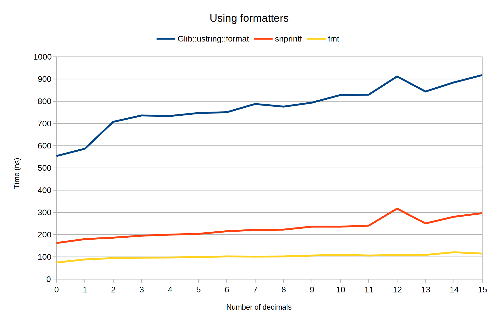
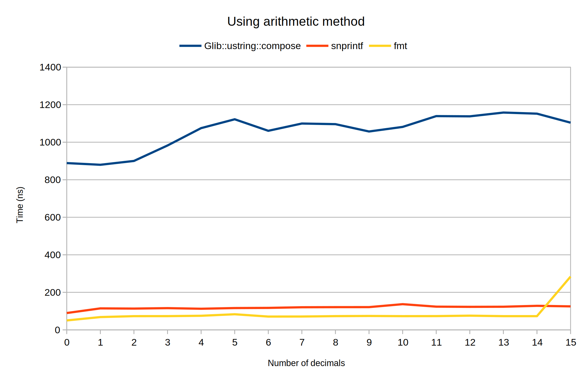
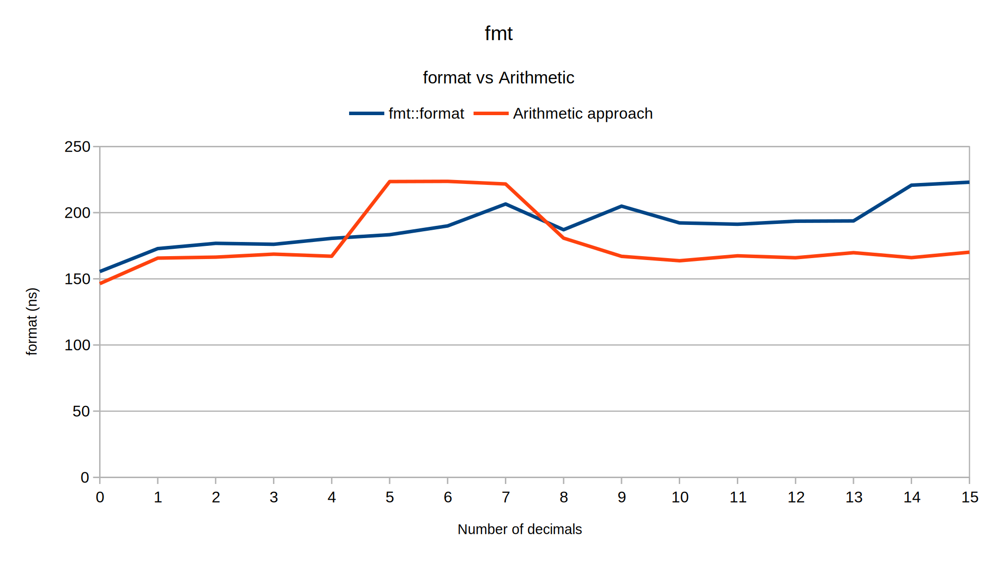
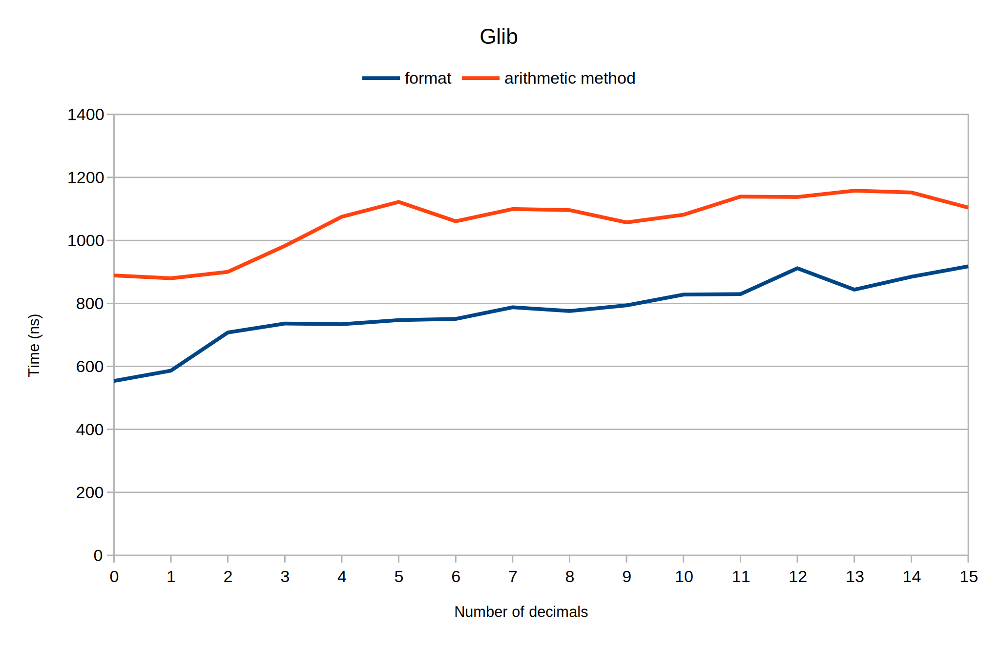
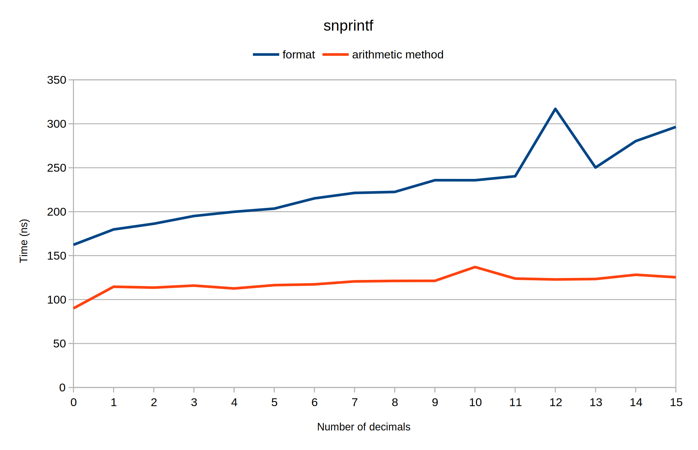

# vs `Glib::ustring` vs `snprintf`

The raw data is available in [here](Benchmark%20-%20variable%20decimals.ods)

# Using formatters for variable decimal precision

1. `Glib::ustring::format`
2. `snprintf`
    - Twice, once for the format string and again for the value
3. `fmt::format`

# Custom `double` formatter with variable decimals

# Conclusion
Enabling optimization (O2) brings down time needed by `{fmt}` to almost half.
A similar improvement cannot be seen for `Glib::ustring::format`.

## `fmt` Simple format vs the arithmetic
There is no major difference between the two approaches.

## `Glib` Simple format vs the arithmetic
On average the arithmetic approach is **769ms** slower. This is expected since 
`Glib::ustring::compose` is slower than `Glib::ustring::format`.

## `snprintf` Simple format vs the arithmetic
The arithmetic approach is expected to be faster since a second call to snprintf is not necessary.

